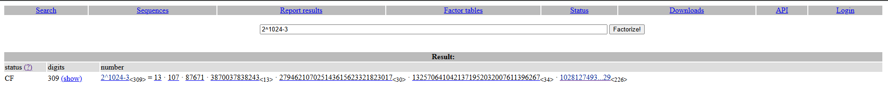
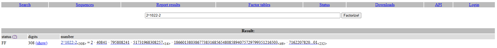
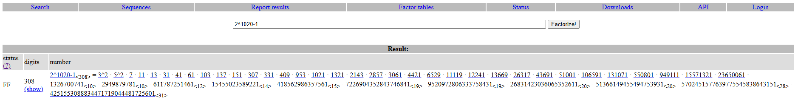

# Solution

We are given the equation: 
$$c \equiv ((((m^e \pmod{m_1}) \pmod{m_2}) \pmod{m_3}) \pmod{m_4})$$

To solve this challenge, I used `factordb` to attempt prime factorization of each $m_i$ where $i \in [1,4]$.

### Case 1: The simplest scenario
Let's assume that the nested modulo operations do not alter the result of the first reduction. Specifically:
$$((((m^e \pmod{m_1}) \pmod{m_2}) \pmod{m_3}) \pmod{m_4}) = m^e \pmod{m_1}$$

This implies that $m^e \pmod{m_1}$ is already smaller than the subsequent moduli. In this case, we can attempt to recover $m$ by calculating $\phi(m_1)$ and the private exponent $d$.

Although I could not fully factorize $m_1$, `factordb` identified 6 distinct prime factors. This partial factorization is sufficient to construct a system of congruences using the Chinese Remainder Theorem (CRT).

**Steps:**

1.  Calculate the partial private exponents for each known prime factor $p_i$:
    $$d_i \equiv e^{-1} \pmod{p_i - 1}, \quad i \in [1,6]$$
2.  Compute the partial plaintexts:
    $$k_i \equiv c^{d_i} \pmod{p_i}, \quad i \in [1,6]$$
3.  Construct the system of equations:
    $$
    \begin{cases}
    m \equiv k_1 \pmod{p_1} \\
    m \equiv k_2 \pmod{p_2} \\
    \vdots \\
    m \equiv k_6 \pmod{p_6}
    \end{cases}
    $$

The solution to this system is $m \pmod{P}$, where $P = p_1 \cdot p_2 \cdots p_6$. If the original message $m < P$, we can successfully recover the flag.

### Case 2, 3, and 4
If Case 1 fails, it implies that the result was reduced by subsequent moduli (e.g., $m_2 < m^e \pmod{m_1}$).
Since $m_1 \approx 4m_2$, we can express:
$$m^e \pmod{m_1} = c + k \cdot m_2, \quad \text{where } k \in [0, 4]$$
We can then iterate through possible values of $k$ and apply the same logic as in Case 1.

My script is available here: [script](./sol.py)

    Flag: W1{RSA_w1th_0v3rl4pp1ng_m0dulo}